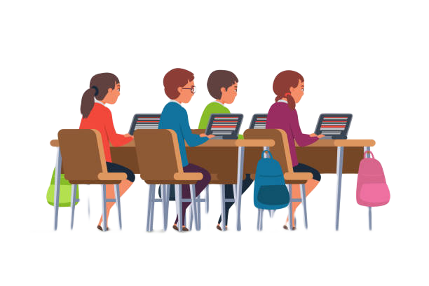

<<<<<<< HEAD
<<<<<<< HEAD
<<<<<<< HEAD
<<<<<<< HEAD
<<<<<<< HEAD
# Web Coding Wednesday

Aiden and Johnson, both grade 7,  are students learning HTML, CSS, JavaScript using *Get Coding!*

## Aiden's Work

[*Get Coding!* Class Work](./aiden)

## Johnson's Work

[*Get Coding!* Class Work](./johnson)
=======
# Green Pretty Alpha using Get Coding!

The Green Pretty Alpha class of kids is learning HTML5, CSS, JavaScript using Get Coding! book 1.
>>>>>>> origin/master
=======
# Green Pretty Alpha using Get Coding!

The Green Pretty Alpha class of kids is learning HTML5, CSS, JavaScript using Get Coding! book 1.
>>>>>>> origin/master
=======
# Green Pretty Alpha using Get Coding!

The Green Pretty Alpha class of kids is learning HTML5, CSS, JavaScript using Get Coding! book 1.
>>>>>>> origin/master
=======
# Green Pretty Alpha using Get Coding!

The Green Pretty Alpha class of kids is learning HTML5, CSS, JavaScript using Get Coding! book 1.
>>>>>>> origin/master
=======
# Green Pretty Alpha using Get Coding!

The Green Pretty Alpha class of kids is learning HTML5, CSS, JavaScript using Get Coding! book 1.
>>>>>>> origin/master
